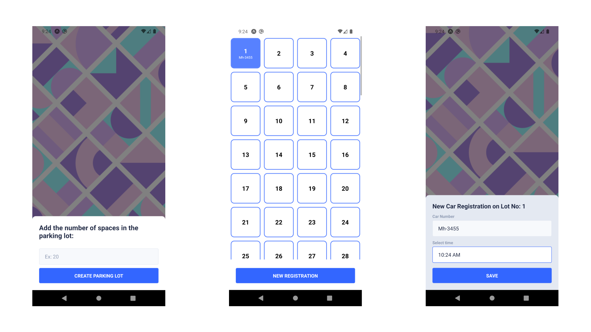

# Parking Lot Managemnet (Assignment 2)

To start with the user will be asked to enter the number of spaces in the parking
lot. The app will then proceed to draw the parking spaces available in the parking
lot - each parking space will show a unique parking space number on it.
The user should be able to add a new car registration and parking time when car
arrives.
The app should allocate random space if available
If no lot is empty show a toast message that parking is full
On exit of the car, the user should be able to press the parking space to enter a
new screen. This screen should display the calculated parking charges and also a
button to deallocate the parking space once payment has been taken. Parking
charges are calculated as follows:
First 2 hours: $10
$10 will be changed for every consecutive hour then after
When the Payment taken button is clicked, make a POST request to
https://httpstat.us/200 with the body : { “car-registration”:<car_registration_string>,”charge”:
<charge_amount_number> }
E.g.{ “car-registration”: “TU68 0BB”, “charge”:20 }


## Screenshots




## Typescript issues

To Prevent `typescript` errors with `UI Kitten`, use `yarn`

```bash
  yarn install
  cd parking_lot
```
[refer this for more info on this issue](https://github.com/facebook/react/issues/24304)

## Run Locally

Clone the project

```bash
  git clone https://github.com/dhruvindsd-dev/parking_lot
```

Go to the project directory

```bash
  cd parking_lot
```

Install dependencies

```bash
  yarn install
```

Start the server

```bash
  yarn start
```
